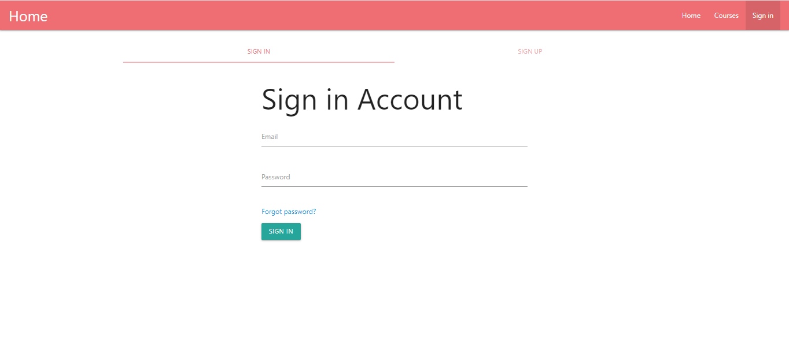
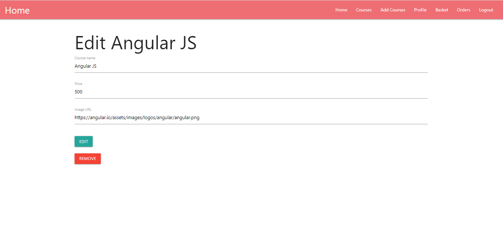
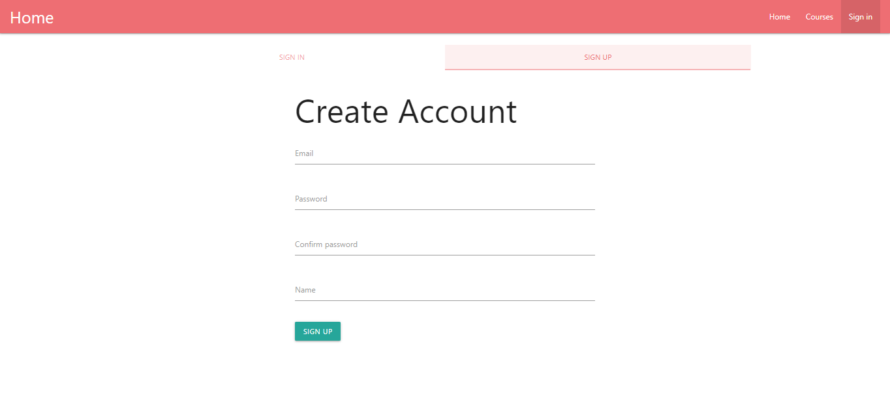
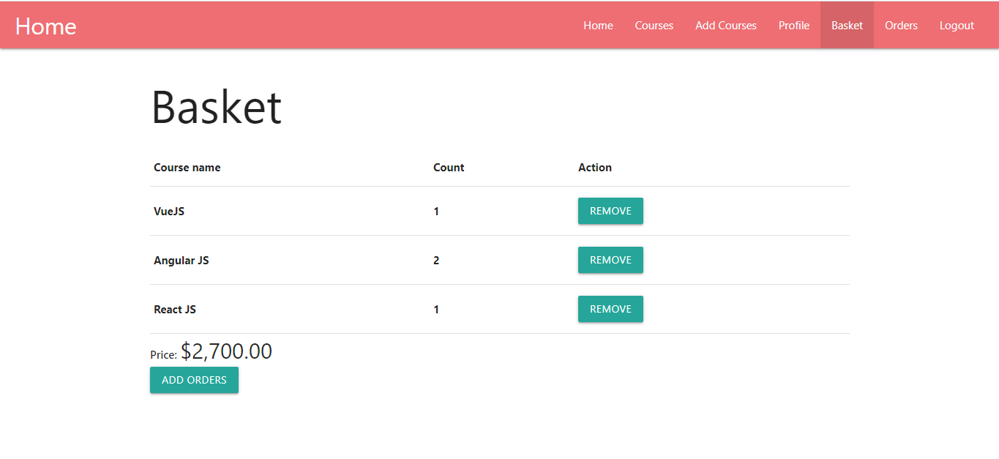
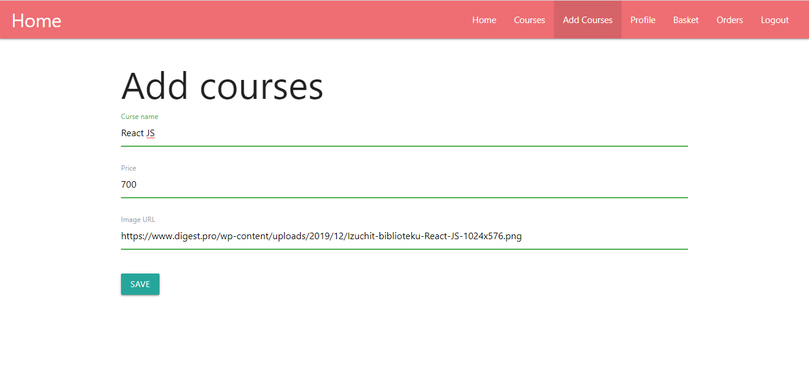
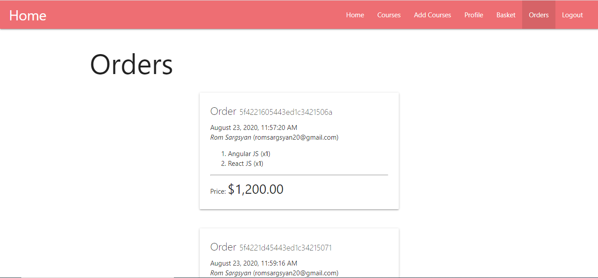
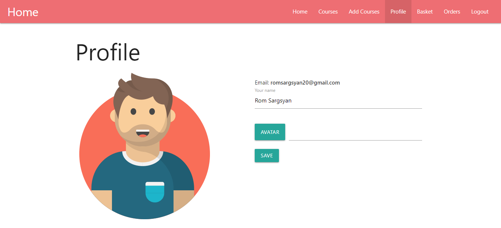
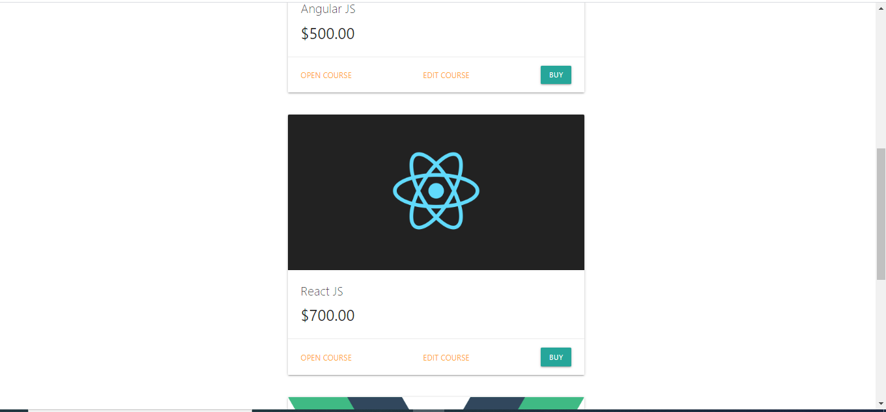

# NodeExpress 

> My funkadelic Node.js project

## Build Setup

``` bash
# install dependencies
$ yarn install

# serve with hot reload at localhost:3000
$ yarn dev

or

# install dependencies
$ npm install

# serve with hot reload at localhost:3000
$ npm run dev
```

# Screenshots
  Check out some themed installs in these screenshots below:

   
   
   
         
